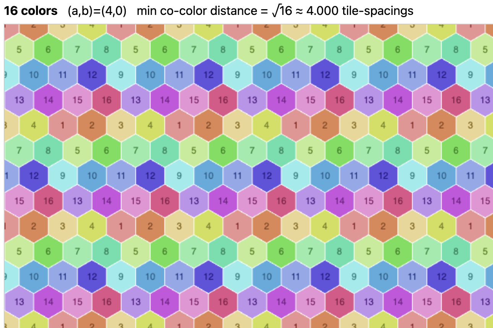

# Hex Tiling Colorings

Interactive visualization of N-color balanced hex tilings using [Loeschian numbers](https://en.wikipedia.org/wiki/Loeschian_number).

For each N (a Loeschian number from 1 to 21), tiles are colored so same-color tiles sit on a sublattice with minimal center-to-center distance of √N tile-spacings.

## Usage

Open `index.html` in any browser — no build step, no dependencies.

## Live Demo

- [hex-tiling.vercel.app](https://hex-tiling.vercel.app)
- [jethrolam.github.io/hex-tiling](https://jethrolam.github.io/hex-tiling/)

## Author

[jethrolam](https://github.com/jethrolam)
